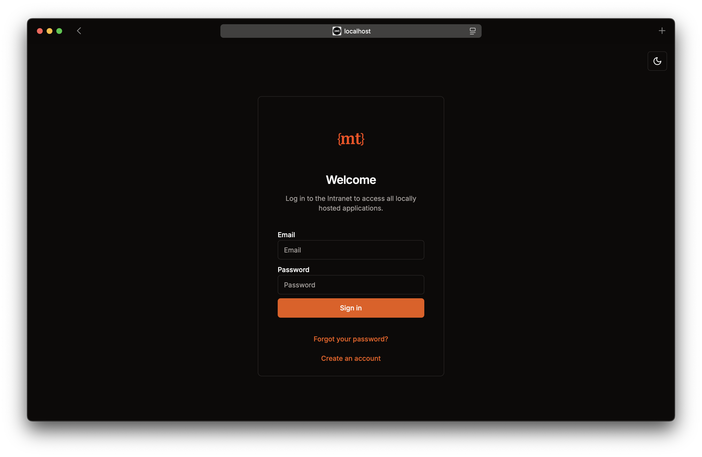
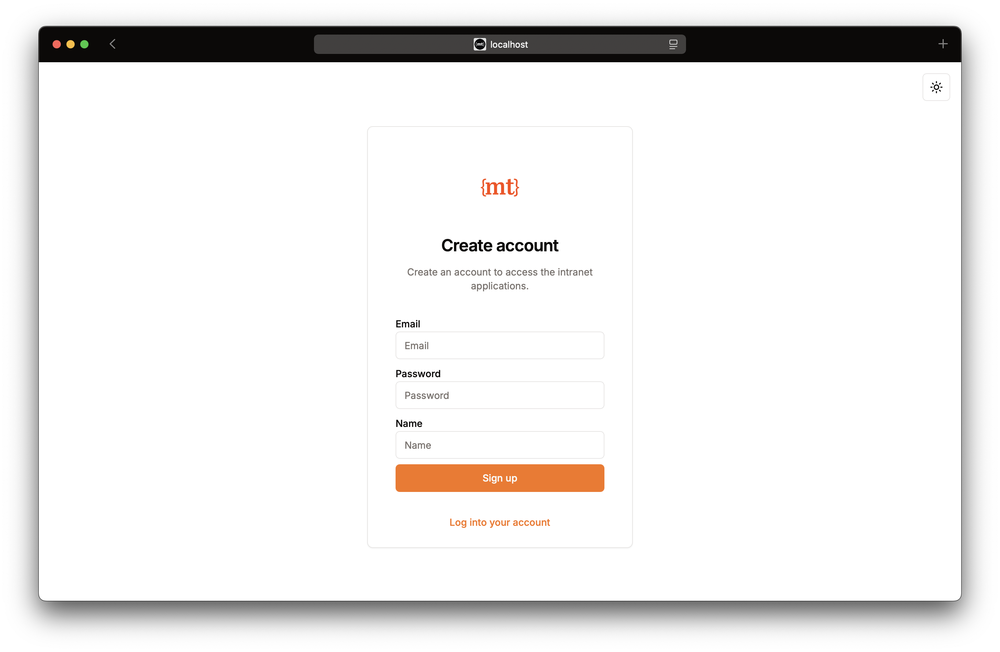
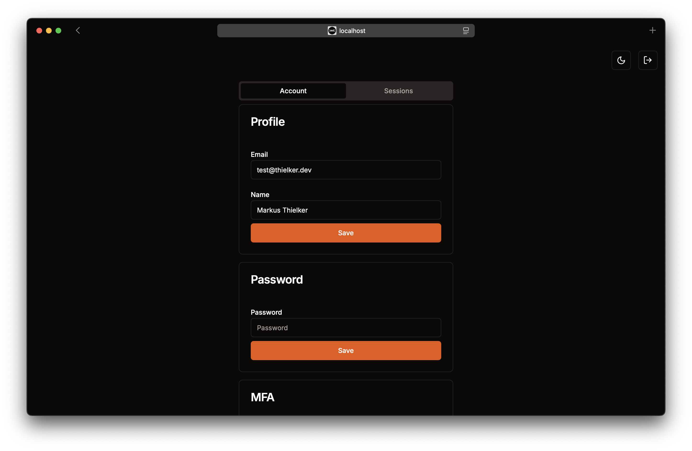
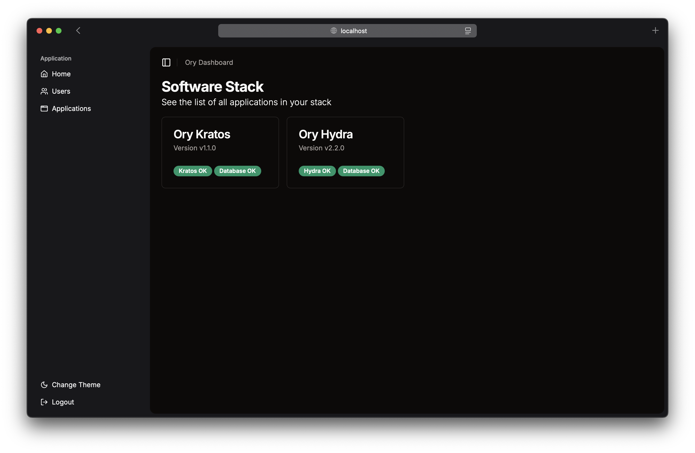
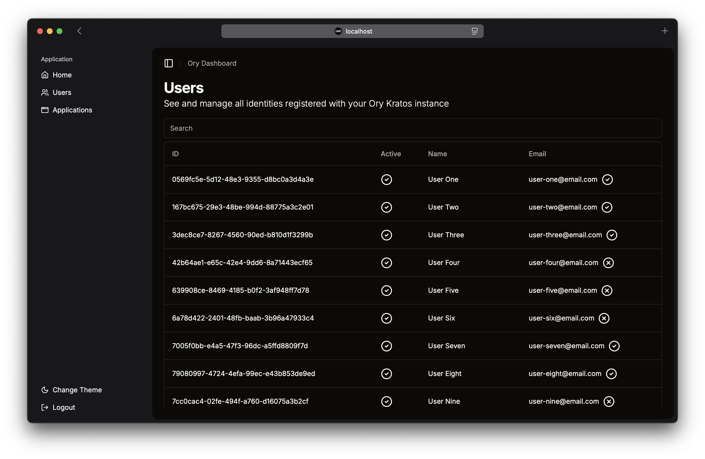

# Next-Ory

Get started with the Ory stack quickly and easily.

> [!Warning]  
> This project is work in progress. There is no guarantee that everything will work as it should and breaking changes in
> the future are possible.

The goal of this project is to create an easy-to-use setup to self-host the [Ory](https://www.ory.sh) stack with all its
components. It will contain an authentication UI, implementing all self-service flows for Ory Kratos and Ory Hydra, as
well as an admin UI. All UI components are written in NextJS and Typescript, and styled using shadcn/ui and TailwindCSS.

## Getting started

Start the backend services using Docker Compose:

```bash
cp /docker/ory-dev/.env.example /docker/ory-dev/.env
docker compose -f docker/ory-dev/docker-compose.yaml up -d

# optional to test consent flow
sh docker/ory-dev/hydra-test-consent.sh
```

Then start the authentication UI:

```bash
cd authentication
cp .env.example .env
bun install
bun run dev
```

Create an account using the authentication UI on http://localhost:3000.
The verification code can be found on the dummy SMTP dashboard on http://localhost:4436.

Inside another terminal session we can start the dashboard UI:

```bash
cd dashboard
cp .env.example .env
bun install
bun run dev
```

To access the admin dashboard, the `identity` has to be a `member` of the `admin` role. (Relation: roles:admin@<
identity_id>#member) <br/>
The identity ID is displayed on the screen when accessing the dashboard without sufficient permissions. <br/>
Use the identity ID to execute the following script with the identity ID as an argument.

```bash
sh docker/ory-dev/keto-make-admin.sh <identity_id>
```

## Deployment

*soon.*

## Authentication UI

The authentication UI is already implemented and working. It supports all self-service flows for Ory Kratos and Ory
Hydra. It is implemented in a way, that customizing style and page layout is very easy.







## Admin Dashboard

Right now I am working on the admin dashboard for all Ory applications. It will provide you with an overview of your
instances and let you manage users, OAuth2 applications and more. It is ***work in progress*** and should be handled
with caution.




