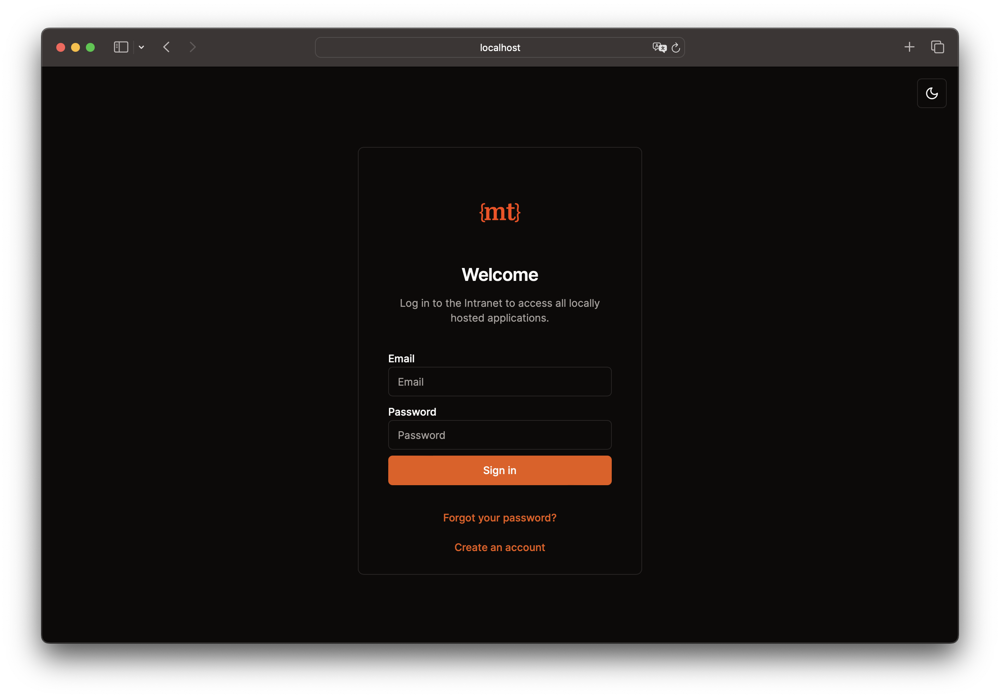
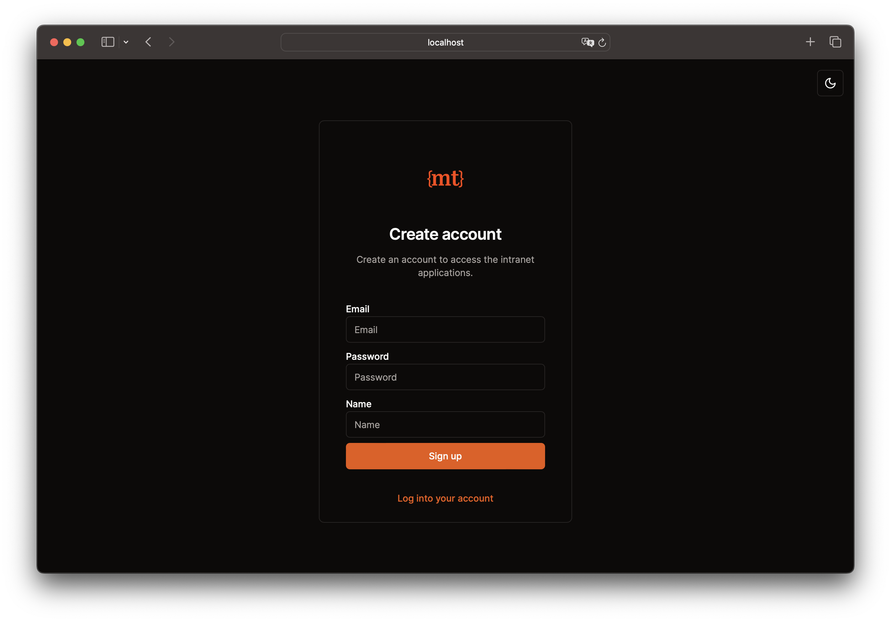

# Next-Ory

Get started with ORY authentication quickly and easily.

> [!Warning]  
> This project is work in progress. There is no guarantee that everything will work as it should and breaking changes in
> the future are possible.

The goal of this project is to create an easy-to-use setup to self-host [Ory Kratos](https://www.ory.sh/kratos)
and [Ory Hydra](https://www.ory.sh/hydra). It will contain an authentication UI, implementing all self-service flows for
Ory Kratos and Ory Hydra, as well as an admin UI. All UI components are written in NextJS and Typescript, and styled
using shadcn/ui and TailwindCSS.

## Getting started

Start the backend services using Docker Compose:

```bash
cp /docker/ory-dev/.env.example /docker/ory-dev/.env
docker compose -f docker/ory-dev/docker-compose.yaml up -d

# optional to test consent flow
sh docker/ory-dev/hydra-test-consent.sh
```

Then start the authentication UI:

```bash
cd authentication
cp .env.example .env
bun install
bun run dev
```

Inside another terminal session we can start the dashboard UI:

```bash
cd dashboard
cp .env.example .env
bun install
bun run dev
```

## Deployment

*soon.*

## Authentication UI

The authentication UI is already implemented and working. It supports all self-service flows for Ory Kratos and Ory
Hydra. It is implemented in a way, that customizing style and page layout is very easy.





## Admin UI

*soon.*

